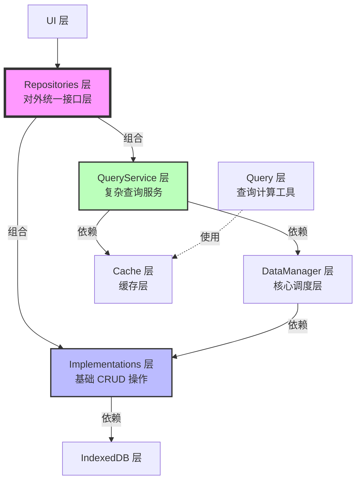

# Database 模块说明

## 概述

本模块负责管理 Bilibili Discovery 系统的所有数据存储和访问，基于 IndexedDB 实现。

### 设计原则

1. **数据结构独立** - 每个数据结构单独一个文件
2. **接口规范分离** - 数据结构定义和接口实现分开存储
3. **职责明确** - 每个接口都有清晰的职责和能力边界
4. **可扩展性** - 支持未来功能扩展
5. **统一入口** - Repositories 层作为唯一数据入口，确保数据流可控
6. **透明组合** - 基础操作和复杂查询透明组合，对外提供统一接口
7. **分层清晰** - Implementations（基础操作）和 QueryService（复杂查询）职责分明

## 架构设计

### 数据流架构

### 各层职责

#### 1. Repositories 层（对外统一接口层）
- **职责**：作为对外唯一开放的数据访问接口，组合基础操作和复杂查询
- **核心功能**：
  - 组合 Implementations 层的基础 CRUD 操作
  - 组合 QueryService 层的复杂查询功能
  - 对外提供统一的操作接口
  - 隐藏内部实现细节
- **特点**：
  - 单一入口：所有数据库操作通过 repositories 层进行
  - 透明组合：内部委托给 implementations 和 query-service
  - 完整功能：同时提供基础操作和复杂查询能力
  - 简化使用：对外提供简洁一致的 API

#### 2. DataManager 层（核心调度层）
- **职责**：统一调度数据流
- **核心功能**：
  - 判断数据来源（cache / DB）
  - 控制加载范围
  - 调用 Query
  - 管理 cache 生命周期
  - 保证数据一致性
- **特点**：
  - 核心调度逻辑
  - 数据流控制
  - 缓存管理

#### 4. Cache 层（缓存层）
- **职责**：纯内存存储，不包含任何逻辑
- **特点**：
  - 只是数据结构（Map、Set等）
  - 不决定何时更新或删除
  - 不包含查询逻辑
  - 作为 Repository 的内部实现细节

#### 5. Query 层（查询层）
- **职责**：纯计算工具，负责数据过滤和排序
- **特点**：
  - 无副作用
  - 不知道 cache 和 DB 的存在
  - 只对给定的数据进行计算
  - 可作为"策略"被 Repository 调用

#### 6. Implementations 层（基础操作层）
- **职责**：提供对 IndexedDB 的底层访问和基础 CRUD 操作
- **核心功能**：
  - 创建、读取、更新、删除（CRUD）等基础操作
  - 基于索引的查询
  - 批量操作支持
- **特点**：
  - 直接访问 IndexedDB
  - 针对性能优化
  - 不包含复杂查询逻辑
  - 提供可靠的基础数据操作

#### 7. QueryService 层（复杂查询层）
- **职责**：补齐 IndexedDB 缺少的复杂查询能力
- **核心功能**：
  - 复杂条件查询
  - 多表关联查询
  - 数据聚合和统计
  - 高级过滤和排序
- **特点**：
  - 只提供查询功能
  - 支持复杂查询场景
  - 基于缓存优化性能
  - 与 Implementations 层互补

## 模块说明

### Repositories 模块（对外统一接口层）
- **category-repository.ts** - 分类数据仓库，组合基础操作和复杂查询
- **tag-repository.ts** - 标签数据仓库，组合基础操作和复杂查询
- **video-repository.ts** - 视频数据仓库，组合基础操作和复杂查询
- **creator-repository.ts** - 创作者数据仓库，组合基础操作和复杂查询
- **collection-repository.ts** - 收藏夹数据仓库，组合基础操作和复杂查询
- **collection-item-repository.ts** - 收藏项数据仓库，组合基础操作和复杂查询

### Manager 模块（核心调度层）
- **tag-data-manager.ts** - 标签数据管理器，统一调度标签数据流
- **video-data-manager.ts** - 视频数据管理器，统一调度视频数据流

### Strategy 模块（策略层）
- **tag-strategy.ts** - 标签数据查询策略，决定"怎么查"
- **video-strategy.ts** - 视频数据查询策略，决定"怎么查"

### Plan 模块（查询计划）
- **query-plan.ts** - 查询计划定义，连接 Repository、DataManager 和 Strategy 层

### Cache 模块
- **data-cache/** - 数据缓存，存储完整的数据对象
  - tag-data-cache.ts - 标签数据缓存
  - video-data-cache.ts - 视频数据缓存
- **index-cache/** - 索引缓存，存储用于快速查询的索引数据
  - video-index-cache.ts - 视频索引缓存
- **lru-cache.ts** - LRU 缓存实现
- **fifo-cache.ts** - FIFO 缓存实现

### Query 模块
- **tag/** - 标签查询
  - tag-query.ts - 标签查询接口
  - tag-query-engine.ts - 标签查询引擎（纯计算工具）
  - debug.ts - 调试工具
- **video/** - 视频查询
  - video-query.ts - 视频查询接口
  - video-query-engine.ts - 视频查询引擎（纯计算工具）
  - debug.ts - 调试工具
- **types.ts** - 查询类型定义

### Implementations 模块（基础操作层）
提供对 IndexedDB 的底层访问实现，包括各种数据仓库的基础 CRUD 操作。
- **category-repository.impl.ts** - 分类基础操作实现
- **tag-repository.impl.ts** - 标签基础操作实现
- **video-repository.impl.ts** - 视频基础操作实现
- **creator-repository.impl.ts** - 创作者基础操作实现
- **collection-repository.impl.ts** - 收藏夹基础操作实现
- **collection-item-repository.impl.ts** - 收藏项基础操作实现
- **image-repository.impl.ts** - 图片基础操作实现
- **settings-repository.impl.ts** - 设置基础操作实现
- **watch-event-repository.impl.ts** - 观看事件基础操作实现

### QueryService 模块（复杂查询层）
补齐 IndexedDB 缺少的复杂查询能力，提供高级查询功能。
- **category-query-service.ts** - 分类复杂查询服务
- **tag-query-service.ts** - 标签复杂查询服务
- **video-query-service.ts** - 视频复杂查询服务
- **creator-query-service.ts** - 创作者复杂查询服务
- **collection-query-service.ts** - 收藏夹复杂查询服务
- **favorite-query-service.ts** - 收藏复杂查询服务

### IndexedDB 模块
- **config.ts** - 数据库配置
- **db-manager.ts** - 数据库管理器
- **db-utils.ts** - 数据库工具类
- **USAGE.md** - 使用说明

## 设计原则

1. **单一职责** - 每个模块只负责一类数据的操作
2. **明确边界** - 每个方法都有清晰的能力边界
3. **可测试性** - 接口设计便于单元测试
4. **可扩展性** - 支持未来功能扩展
5. **类型安全** - 完整的 TypeScript 类型定义
6. **统一入口** - Repositories 层作为唯一数据入口，确保数据流可控
7. **透明组合** - 基础操作和复杂查询透明组合，对外提供统一接口
8. **分层清晰** - Implementations（基础操作）和 QueryService（复杂查询）职责分明
