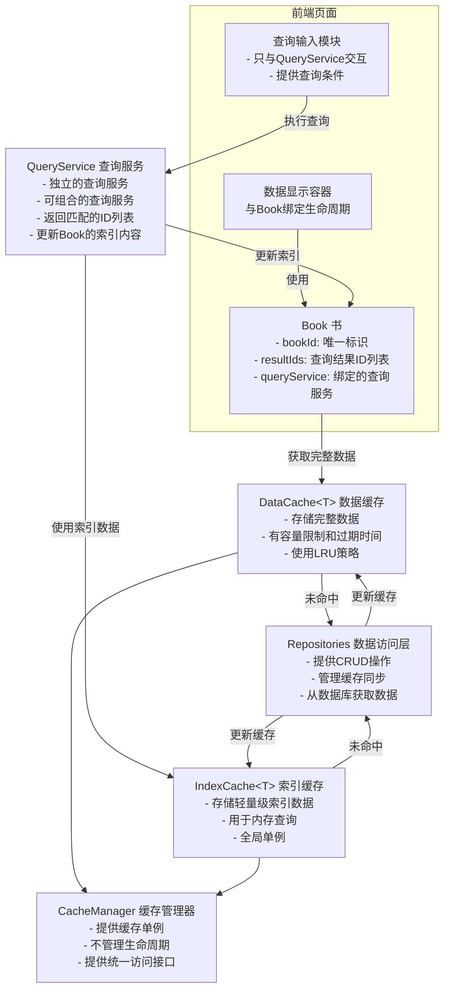

# Query-Server 架构说明

## 概述

Query-Server模块提供高性能的数据查询和分页管理功能，采用四层架构设计：

1. **数据缓存层（Cache Layer）**：管理索引和完整数据的内存缓存
2. **查询服务层（Query Layer）**：执行查询逻辑，返回结果ID列表
3. **书管理层（Book Layer）**：管理查询结果和分页数据
4. **数据访问层（Repositories Layer）**：封装数据库操作和缓存管理

## 第一层：数据缓存层

### 缓存类型

#### 1. 索引缓存（IndexCache<T>）

存储轻量级索引数据，用于在内存中执行全量复杂条件查询：

**特性：**
- 存储用于查询的轻量级数据（如CreatorIndex、VideoIndex）
- 不包含过期时间，长期驻留内存
- **无容量限制**，不需要清理
- 支持批量操作
- 全局单例，相同数据类型唯一

**初始化机制：**
- 只在需要时从数据库拉取数据
- 前端调用查询服务时，检查索引缓存是否存在数据
- 不存在则从数据库全量拉取并建立索引缓存
- 如果程序运行但未使用任何查询，索引缓存不会拉取数据

**更新机制：**
- 只由 `src\database
epositories` 的实例进行更新
- 不会同步到数据库
- 不需要与数据库完全同步
- 重启后从数据库重建

**示例数据结构：**
```typescript
// CreatorIndex - 创作者索引
interface CreatorIndex {
  creatorId: string;
  name: string;
  tags: string[];
  isFollowing: boolean;
}

// VideoIndex - 视频索引
interface VideoIndex {
  videoId: string;
  platform: Platform;
  creatorId: string;
  title: string;
  duration: number;
  publishTime: number;
  tags: string[];
  isInvalid?: boolean;
}
```

#### 2. 数据缓存（DataCache<T>）

存储完整数据对象，有容量限制：

**特性：**
- 存储完整数据（如Creator、Video）
- 包含过期时间（默认1小时）
- 使用LRU策略管理容量
- 支持批量操作
- 全局单例，相同数据类型唯一

**容量管理：**
- 使用数量限制而非实际占用限制（数量计算更快，不需要十分准确）
- 不同数据类型的上限根据单条数据大小调整
- 数据占用内存大 → 上限少一些
- 数据占用内存小 → 上限多一些
- **最小支持50条数据**
- **最多支持1000条数据**

**更新机制：**
- 只由 `src\database
epositories` 的实例进行更新
- 不会同步到数据库
- 不需要与数据库完全同步
- 重启后从数据库重建

**示例数据结构：**
```typescript
// Creator - 完整创作者数据
interface Creator {
  creatorId: string;
  name: string;
  description?: string;
  avatar?: string;
  tagWeights: TagWeight[];
  isFollowing: 0 | 1;
  // ... 其他完整字段
}

// Video - 完整视频数据
interface Video {
  videoId: string;
  platform: Platform;
  creatorId: string;
  title: string;
  description?: string;
  cover?: string;
  duration: number;
  publishTime: number;
  tags: string[];
  isInvalid?: boolean;
  // ... 其他完整字段
}
```

#### 3. 标签缓存（TagCache）

存储标签到多种数据类型ID集合的映射，用于优化标签查询：

**核心设计理念：**
- 相同的tag可以同时对应创作者、视频或其他数据类型
- 为了节约内存，tag映射应该只存在一个
- tag映射的不是简单的数据集合，而是复杂的数据结构
- 该结构可以包含创作者ID集合、视频ID集合，还能扩展新的数据类型

**数据结构：**
```typescript
// 标签映射数据结构
interface TagMapping {
  creatorIds: Set<string>;  // 创作者ID集合
  videoIds: Set<string>;    // 视频ID集合
  // 可扩展其他数据类型
  [key: string]: Set<string>;  // 动态扩展
}

// 标签缓存条目
interface TagCacheEntry {
  tagId: string;            // 标签ID
  mapping: TagMapping;       // 标签映射
  lastUpdate: number;        // 最后更新时间
  totalCount: number;        // 总数据量（所有类型之和）
}
```

**特性：**
- 存储标签ID到多种数据类型ID集合的映射
- 使用Set确保ID唯一性
- 支持动态扩展新的数据类型
- **不包含过期时间，长期驻留内存**
- **无容量限制，不需要清理**
- 用于加速标签过滤操作
- 全局单例，所有数据类型共享

**初始化机制：**
- 与IndexCache相同，只在需要时从数据库拉取数据
- 前端调用查询服务时，检查TagCache是否存在数据
- 不存在则从数据库全量拉取并建立TagCache
- 如果程序运行但未使用任何查询，TagCache不会拉取数据

**更新机制：**
- 只由 `src\database
epositories` 的实例进行更新
- 不会同步到数据库
- 不需要与数据库完全同步
- 重启后从数据库重建

**优势：**
1. **内存优化**：相同tag只存储一次映射
2. **类型安全**：通过泛型确保类型安全
3. **可扩展**：可以轻松添加新的数据类型
4. **高效查询**：一次查询可获取所有相关数据

### 缓存管理器（CacheManager）

**职责：**
- 仅提供不同数据类型的缓存单例
- 确保相同数据类型的缓存实例全局唯一
- 提供统一的缓存访问接口
- **不管理单例的生命周期**，仅作为单例提供方法的入口

**设计要点：**
- 使用单例模式
- 通过泛型确保类型安全
- 延迟初始化缓存实例
- 支持缓存统计和监控

**缓存类型来源：**
- 所有数据类型定义在 `src\database	ypes` 中
- 所有缓存实例基于这些类型创建
- 确保类型的一致性和可追溯性

## 第二层：查询服务层

### 查询服务规范

所有查询服务必须遵守以下规范：

**输入规范：**
```typescript
interface QueryInput<T> {
  indexes: T[];              // 索引数据列表
  condition: QueryCondition; // 查询条件
  cacheKey?: string;         // 可选的缓存键
}
```

**输出规范：**
```typescript
interface QueryOutput {
  matchedIds: string[];      // 匹配的ID列表
  stats?: QueryStats;        // 查询统计信息（可选）
}
```

### 查询服务类型

#### 1. 基础查询服务

每个基础查询服务专注于单一查询维度：

**名称/标题查询服务：**
- Creator: 按创作者名称匹配
- Video: 按视频标题匹配
- 逻辑相同，处理对象不同

**标签查询服务：**
- 支持AND、OR、NOT操作
- 可同时用于Creator和Video
- 使用TagFilterEngine实现

**关注状态查询服务：**
- 过滤已关注/未关注的创作者
- 过滤已关注创作者的视频

#### 2. 复合查询服务

通过组合多个基础查询服务实现复杂查询：

**示例：Creator复合查询**
```typescript
interface CreatorCompositeQuery {
  keyword?: string;              // 名称关键词
  tagExpressions?: TagExpression[]; // 标签表达式
  isFollowing?: 0 | 1;           // 关注状态
  platform: Platform;            // 平台
}
```

**组合规则：**
- 查询条件的输出可作为下一个查询条件的输入
- 减少组合查询的计算量
- 不强制所有查询服务都可组合
- **只有针对相同数据的查询服务可以组合**

**可组合示例：**
- Creator查询服务：name查询 + 关注状态查询 + 标签查询 = 可组合
- 这些查询服务都针对Creator数据，因此可以组合

**不可组合示例：**
- Video标题查询服务 ≠ Creator查询服务 = 不可组合
- 这些查询服务针对不同数据，因此不能组合

**组合方式：**
- 优先级：关注状态 > 标签过滤 > 名称/标题过滤
- 每个过滤条件由独立的基础查询服务处理
- 复合服务负责协调和组合

### 查询服务特性

**独立性：**
- 每个查询服务相互独立
- 可单独使用
- 可组合使用

**可组合性：**
- 遵守统一的输入输出规范
- 支持链式调用
- 支持并行执行
- 查询条件的输出可作为下一个查询条件的输入

**复用性：**
- 相同逻辑可在不同数据类型间复用
- 如标签过滤逻辑同时支持Creator和Video

## 第三层：书管理层

### Book（书）

Book是查询结果的容器，管理ID列表和分页数据：

**职责：**
- **只存储查询返回的索引数据**
- **不存储完整对象**
- 支持泛型，支持更多数据索引
- 负责完整数据的获取与写入DataCache
- 支持预加载功能
- 与前端页面数据显示容器绑定生命周期

**与查询服务的关系：**
- Book只与一个查询服务绑定
- 通过该查询服务调用来更新Book实例的索引内容
- 查询条件只给查询服务使用，Book不存储查询条件

**数据获取流程：**
1. Book持有索引数据
2. 需要数据时，先尝试从DataCache获取
3. 缓存未命中，从数据库获取
4. 获取后更新DataCache

**预加载功能：**
- Book不存储数据，但支持预加载
- 提前尝试获取更多数据
- 让数据先一步存储于DataCache中
- 翻页时通过命中缓存快速获取

**生命周期：**
- 与页面数据显示容器绑定
- 与页面生命周期一致
- **不需要额外字段管理生命周期**

**数据结构：**
```typescript
interface Book<T> {
  bookId: string;              // 书的唯一标识
  resultIds: string[];         // 结果ID列表（只存储索引）
  queryService: QueryService;   // 绑定的查询服务
}

interface BookState {
  currentPage: number;         // 当前页码
  totalPages: number;          // 总页数
  pageSize: number;            // 每页大小
  totalRecords: number;        // 总记录数
}

interface BookPage<T> {
  page: number;                // 页码
  items: T[];                  // 数据列表（从DataCache获取）
  loaded: boolean;             // 是否已加载
  loadTime?: number;           // 加载时间
}
```

### BookManager（书管理器）

**职责：**
- 创建和管理Book实例
- 提供分页数据获取
- 管理Book生命周期（与页面生命周期一致）
- **直接与数据库和DataCache单例交互**
- 基于Book中通过查询拿到的索引获取数据

**数据获取流程：**
1. Book持有查询返回的索引
2. BookManager先尝试从DataCache获取完整数据
3. 缓存未命中，直接通过数据库获取
4. 获取后更新DataCache内容
5. 返回完整数据给前端

**核心方法：**
```typescript
class BookManager<T> {
  // 创建新书
  createBook(bookId: string, queryService: QueryService): Book<T>;

  // 获取书
  getBook(bookId: string): Book<T> | undefined;

  // 获取分页数据（先从DataCache获取，未命中则从数据库获取）
  getPage(bookId: string, pageNumber: number): BookPage<T>;

  // 预加载分页数据（提前获取数据到DataCache）
  preloadPage(bookId: string, pageNumber: number): Promise<void>;

  // 通过查询服务更新书的索引内容
  updateBookIndex(bookId: string, queryCondition: QueryCondition): Promise<void>;

  // 删除书
  deleteBook(bookId: string): boolean;
}
```

## 完整架构流程



## 使用流程

### 1. 初始化缓存

```typescript
// 获取缓存管理器单例
const cacheManager = CacheManager.getInstance();

// 获取需要的缓存实例
const creatorIndexCache = cacheManager.getCreatorIndexCache();
const videoIndexCache = cacheManager.getVideoIndexCache();
const dataCache = cacheManager.getDataCache();
```

### 2. 创建查询服务

```typescript
// 创建基础查询服务
const nameQueryService = new NameQueryService();
const tagQueryService = new TagQueryService();
const followingQueryService = new FollowingQueryService();

// 创建复合查询服务（组合基础服务）
const creatorCompositeQueryService = new CreatorCompositeQueryService({
  nameQueryService,
  tagQueryService,
  followingQueryService
});
```

### 3. 创建Book和执行查询

```typescript
// 创建BookManager
const bookManager = new BookManager(dataCache);

// 创建Book（与查询服务绑定）
const bookId = 'creator-search-page-1';
const book = bookManager.createBook(
  bookId,
  creatorCompositeQueryService  // 绑定的查询服务
);

// 执行查询并更新Book的索引内容
const queryCondition = {
  type: 'composite',
  keyword: '游戏',
  tagExpressions: [{ tagId: 'tag1', operator: 'AND' }],
  isFollowing: 0,
  platform: 'bilibili'
};

await bookManager.updateBookIndex(bookId, queryCondition);
```

### 4. 获取分页数据

```typescript
// 获取第一页数据
const page1 = bookManager.getPage(bookId, 0);
console.log(page1.items);  // 第一页的完整数据
console.log(page1.state); // 分页状态信息

// 获取第二页数据
const page2 = bookManager.getPage(bookId, 1);
```

### 5. 更新查询条件

```typescript
// 更新查询条件
const newCondition = {
  type: 'composite',
  keyword: '音乐',
  tagExpressions: [{ tagId: 'tag2', operator: 'AND' }],
  isFollowing: 1,
  platform: 'bilibili'
};

// 通过查询服务更新Book的索引内容
await bookManager.updateBookIndex(bookId, newCondition);
```

### 6. 页面销毁

```typescript
// 页面销毁时,删除Book
bookManager.deleteBook(bookId);
```

## 设计原则

### 1. 职责分离

- **缓存层**: 只负责数据存储和检索
- **查询服务层**: 只负责查询逻辑
- **书管理层**: 只负责结果管理和分页

### 2. 单向依赖

- 上层依赖下层,下层不依赖上层
- Book依赖QueryService,QueryService依赖Cache
- Cache不依赖任何上层模块

### 3. 全局共享

- 相同数据类型的缓存实例全局唯一
- 所有查询服务共享相同的缓存实例
- 避免重复创建缓存实例

### 4. 类型安全

- 使用TypeScript泛型确保类型安全
- 所有接口都有明确的类型定义
- 编译时类型检查

### 5. 可扩展性

- 新增数据类型只需实现相应的接口
- 新增查询服务只需遵守查询服务规范
- 通过组合实现复杂查询

### 6. 性能优化

- 索引缓存长期驻留内存,避免频繁加载
- 数据缓存使用LRU策略,自动管理容量
- 标签缓存优化标签查询性能
- 支持批量操作,减少开销

### 7. 生命周期管理

- Book的生命周期由前端页面控制
- 缓存的生命周期由CacheManager管理
- 页面销毁时必须删除对应的Book

## 第四层：Repositories层

### Repositories的职责

Repositories是数据访问层，封装了所有数据库操作和缓存管理：

**核心职责：**
1. 提供基于数据库的基础操作（CRUD）
2. 提供基于缓存机制的复杂查询
3. 直接管理单例缓存
4. 确保缓存和数据库的同步（大部分情况）

**缓存同步机制：**
- **创建新数据**：写入数据库 + 更新缓存
- **更新数据**：更新数据库 + 更新缓存
- **删除数据**：删除数据库 + 删除缓存
- 允许少量不同步
- 重启后从数据库重建缓存

**同步保证：**
- 在绝大部分情况下，可以保证缓存和数据库是同步的
- 即使不同步也没关系，因为：
  - 不会通过cache来更新数据库
  - 只有一个失败一个成功的时候数据才会开始不同步
  - 重启软件后，cache的数据来源又是基于数据库的
- 因此这样做在大部分时候都能保证数据是相同的，少量的错误也完全没关系

**与缓存层的关系：**
- Repositories是唯一可以更新缓存的入口
- 缓存不会同步到数据库
- 缓存层不需要和数据库进行完全同步
- 缓存层也不会基于缓存层来更新数据库
