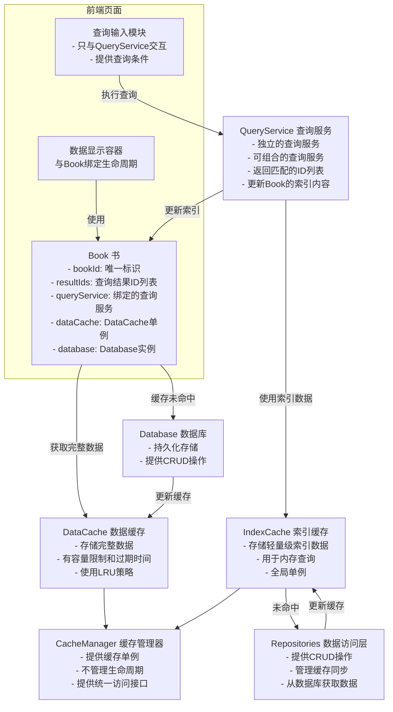

# Query-Server 架构说明

## 概述

Query-Server模块提供高性能的数据查询和分页管理功能，采用四层架构设计：

1. **数据缓存层（Cache Layer）**：管理索引和完整数据的内存缓存
2. **查询服务层（Query Layer）**：执行查询逻辑，返回结果ID列表
3. **书管理层（Book Layer）**：管理查询结果和分页数据
4. **数据访问层（Repositories Layer）**：封装数据库操作和缓存管理

### 架构设计原则

本架构遵循以下核心设计原则：

1. **查询与存储彻底解耦**：查询层不依赖数据库，数据库不参与复杂查询
2. **Cache成为查询引擎载体**：使用内存结构替代数据库查询能力，构建自建的内存查询引擎
3. **Repository成为唯一数据入口**：所有缓存操作必须通过Repository层，确保数据一致性
4. **职责单一化**：每个模块只负责自己的核心职责，避免职责过载
5. **工程可控性**：架构设计考虑长期可维护性和可扩展性

## 模块说明

各模块的详细文档请参考对应目录下的README文件：

- **缓存层（Cache）**：详见 [cache/README.md](./cache/README.md)
  - 索引缓存（IndexCache）
  - 数据缓存（DataCache）
  - 标签缓存（TagCache）
  - 缓存管理器（CacheManager）

- **查询服务层（Query）**：详见 [query/README.md](./query/README.md)
  - 基础查询服务
  - 复合查询服务
  - 查询引擎
  - 标签过滤引擎

- **书管理层（Book）**：详见 [book/README.md](./book/README.md)
  - Book（书）
  - BookManager（书管理器）

- **数据访问层（Repositories）**：详见 [../repositories/](../repositories/)
  - CreatorRepository
  - VideoRepository

## 完整架构流程



## 使用流程

### 1. 初始化缓存

```typescript
// 获取缓存管理器单例
const cacheManager = CacheManager.getInstance();

// 获取需要的缓存实例
const creatorIndexCache = cacheManager.getCreatorIndexCache();
const videoIndexCache = cacheManager.getVideoIndexCache();
const dataCache = cacheManager.getDataCache();
```

### 2. 创建查询服务

```typescript
// 创建基础查询服务
const nameQueryService = new NameQueryService();
const tagQueryService = new TagQueryService();
const followingQueryService = new FollowingQueryService();

// 创建复合查询服务（组合基础服务）
const creatorCompositeQueryService = new CreatorCompositeQueryService({
  nameQueryService,
  tagQueryService,
  followingQueryService
});
```

### 3. 创建Book和执行查询

```typescript
// 创建BookManager
const bookManager = new BookManager();

// 获取DataCache单例和Database实例
const dataCache = cacheManager.getDataCache<Creator>();
const database = getDatabase();

// 创建Book实例
const book = bookManager.createBook<Creator>(
  'creator-query-book',
  creatorCompositeQueryService,
  dataCache,
  database
);

// 执行查询更新索引
await book.updateIndex({
  keyword: 'test',
  tagExpressions: [...],
  isFollowing: 1,
  platform: Platform.BILIBILI
});

// 获取分页数据
const page1 = await book.getPage(1, 20);
const page2 = await book.getPage(2, 20);

// 预加载下一页
await book.preloadPage(3, 20);

// 不再需要时删除Book
bookManager.deleteBook('creator-query-book');
```

## 目录结构

```
query-server/
├── cache/              # 缓存层
│   ├── README.md       # 缓存层详细文档
│   ├── base-cache.ts   # 基础缓存抽象
│   ├── cache-manager.ts # 缓存管理器
│   ├── data-cache.ts   # 数据缓存
│   ├── index-cache.ts  # 索引缓存
│   └── types.ts        # 缓存类型定义
├── query/              # 查询服务层
│   ├── README.md       # 查询服务层详细文档
│   ├── query-engine.ts # 查询引擎
│   ├── query-service.ts # 查询服务基类
│   ├── composite-query-service.ts # 复合查询服务
│   ├── tag-filter-engine.ts # 标签过滤引擎
│   └── types.ts        # 查询类型定义
├── book/               # 书管理层
│   ├── README.md       # 书管理层详细文档
│   ├── base-book-manager.ts # 基础书管理器
│   ├── creator-book-manager.ts # 创作者书管理器
│   ├── video-book-manager.ts   # 视频书管理器
│   └── types.ts        # 书类型定义
└── README.md           # 本文档
```
